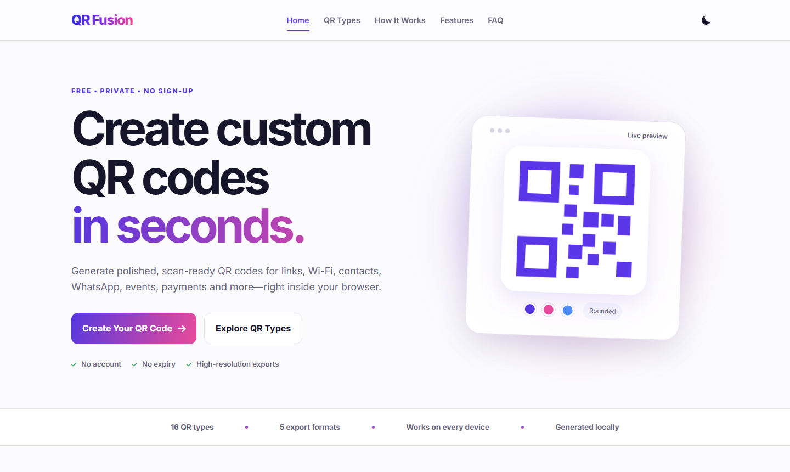

<div align="center">
  

  <h1>QR Fusion</h1>

  <p><strong>Create polished, customizable, and scan-ready QR codes directly in your browser.</strong></p>

  <p>16 QR types · Live customization · Scan-quality feedback · 5 export formats</p>

  <p><a href="https://qrfusion.pages.dev/"><strong>Open QR Fusion</strong></a></p>
</div>

QR Fusion is a privacy-focused, frontend-only QR code generator for links, Wi-Fi networks, contacts, events, payments, social profiles, and more. QR content is generated locally in the browser, so no account or application backend is required.

[](https://qrfusion.pages.dev/)

## Key features

- **Purpose-built QR types:** Create codes for links, Wi-Fi, contacts, events, payments, social profiles, messaging, app listings, and more.
- **Live customization:** Preview design changes immediately while adjusting colors, gradients, shapes, corner frames, eye styles, and export size.
- **Brand controls:** Upload a logo and fine-tune its size and margin without leaving the editor.
- **Scan-quality feedback:** Check contrast, content density, transparency, and logo size before exporting a design.
- **Flexible exports:** Download individual PNG, JPEG, SVG, or PDF files, or package every format in a ZIP archive.
- **Private by design:** Generate QR payloads in the browser without an account or application backend.
- **Workflow conveniences:** Use presets, save non-sensitive drafts, import or export settings, copy a QR image, and share through supported devices.
- **Responsive PWA:** Work across desktop and mobile layouts with light and dark themes plus an offline application shell.

## Supported QR types

| Type | Purpose |
| --- | --- |
| Text & URL | Open a web address or display plain text. |
| Wi-Fi | Join a wireless network without typing its credentials. |
| vCard | Save personal or business contact information. |
| WhatsApp | Open a chat with an optional pre-filled message. |
| Google Review | Send customers directly to a business review page. |
| Event | Add an event with dates, times, location, and notes to a calendar. |
| Payment | Share UPI payment details or readable bank information. |
| Social Media | Open a social profile or channel. |
| YouTube | Open a video, Short, playlist, or channel. |
| Google Play | Open an Android application listing. |
| Apple App Store | Open an iPhone or iPad application listing. |
| Email | Compose an email with a recipient, subject, and message. |
| SMS | Open a text message with a phone number and optional message. |
| Location | Open an address or map destination. |
| Phone Call | Open the dialer with a phone number ready to call. |
| Login QR / Passkey | Open a passwordless sign-in or passkey URL. |

## Export formats

| Format | Best suited for |
| --- | --- |
| PNG | Websites, presentations, messaging, and general digital use. |
| JPEG | Platforms or documents that require a standard raster image. |
| SVG | Scalable graphics, large-format printing, and further design work. |
| PDF | Sharing or printing a ready-to-use QR document. |
| ZIP | Downloading PNG, JPEG, SVG, and PDF versions together. |

## Privacy and data handling

- QR payloads and customizations are processed in the browser; QR Fusion does not require an application backend or user account.
- Non-sensitive form drafts, design settings, theme selection, and preview position are stored in the browser's `localStorage`.
- Saved drafts exclude Wi-Fi passwords, UPI details, bank-account information, file inputs, and other password fields.
- Uploaded logos are used through a temporary browser object URL and are not included in saved drafts or exported settings.
- PIN-code address lookup sends only the entered PIN code to the external `api.postalpincode.in` service.
- Copy and native sharing actions run only when initiated by the user and depend on browser and device support.

## External dependencies

| Dependency | Role | Delivery |
| --- | --- | --- |
| QR Code Styling 1.5.0 | Generates and styles QR codes. | unpkg CDN |
| jsPDF 2.5.1 | Creates PDF exports. | cdnjs CDN |
| JSZip 3.10.1 | Packages all export formats into ZIP files. | cdnjs CDN |
| Font Awesome 6.5.1 | Provides interface icons. | cdnjs CDN |
| Inter | Provides the application typeface. | Google Fonts |
| Postal PIN Code API | Looks up address details from an Indian PIN code. | `api.postalpincode.in` |

The service worker caches the application shell and CDN assets after a successful online load to support later offline use.

## Local development

QR Fusion is a static application, so it does not require dependency installation or a build command.

1. Clone the repository and enter the project directory:

   ```bash
   git clone https://github.com/harsh-hsy/qrfusion.git
   cd qrfusion
   ```

2. Open the directory in VS Code.
3. Serve `index.html` with the Live Server extension.
4. Open the local URL provided by Live Server, typically `http://127.0.0.1:5500/`.

Serve the project over HTTP instead of opening `index.html` directly from the file system. Local navigation uses `/generator.html?type=...` because Live Server does not process Cloudflare's `_redirects` file. Production uses clean routes such as `/create`, `/wifi`, `/whatsapp`, and `/google-review`.

## Deployment

The production site is hosted on [Cloudflare Pages](https://qrfusion.pages.dev/) and deploys automatically from the `main` branch.

| Cloudflare setting | Value |
| --- | --- |
| Framework preset | None |
| Build command | None |
| Build output directory | Repository root (`.`) |
| Production branch | `main` |

The `_redirects` file maps public clean URLs to the generator page. Pushing a commit to `main` triggers a new production deployment.

## Project structure

```text
qrfusion/
├── index.html                    # Marketing landing page
├── generator.html                # QR generator markup and forms
├── assets/
│   ├── favicon/                  # Icons and web-app manifest
│   └── readme/                   # Repository preview images
├── css/
│   ├── style.css                 # App, controls, exports, responsive layout
│   └── landing.css               # Landing-page design and breakpoints
├── js/
│   ├── core/app.js               # QR payloads, routing, preview, downloads
│   ├── features/ui-features.js   # Presets, drafts, quality, SEO, PWA setup
│   ├── pages/landing.js          # Landing navigation and theme behavior
│   └── data/                     # Embedded PDF background/logo assets
├── service-worker.js             # Offline application shell and runtime cache
├── _redirects                    # Cloudflare Pages clean-URL rewrites
├── sitemap.xml                   # Search-engine URL discovery
├── robots.txt                    # Crawler rules
└── LICENSE                       # MIT License
```

## License

QR Fusion is available under the [MIT License](LICENSE).
